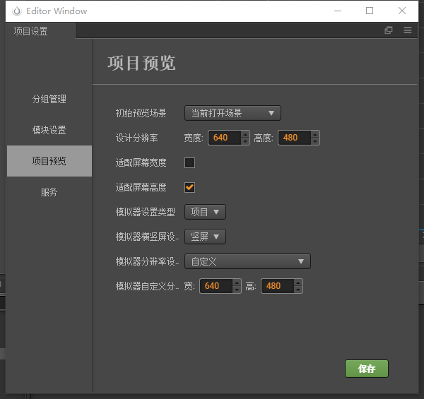

# canvas的默认大小设置
 在《游戏开发的数学和物理》的例子中，默认的窗口大小是640 * 480。但是Cocos Creator默认创建的Canvas大小为960 * 640。为了使Canvas的大小也为640 * 480，可以通过设置Canvas组件的Design Resolustion，但是每次创建一个场景都要去修改Canvas组件的Design Resolution这样就太麻烦了。为了偷懒，我想让每次创建场景的时候默认创建的Canvas的大小就是640 * 480。联想到之前只用Cocos Studio的经验，在cocos studio中，可以设置每次创建的层的大小。我想在Cocos Creator中也应该有这个功能。然后我就在菜单栏中找带“设置”这种功能的菜单。刚开始我点的是“Cocos Creator”这个菜单，进入到“偏好设置”，点到“预览运行”的时候看到里面有设置分辨率的，然后我就修改宽高分别为640和480，但是保存返回编辑器时，新建一个Canvas，发现它的大小还是默认的960 * 640，看来没用啊。只能去找其他带“设置”功能的地方。在“项目”，“项目设置”，“项目预览”看到了设置宽高的地方。这次我修改了宽高为640*480，然后在“层级管理器”中新建了一个Canvas，发现这次是对的。回头我重新看了这2次的设置操作。在“Cocos Creator”中的“偏好设置”里面设置的窗口宽高是模拟器的分辨率。在“项目设置”，“项目预览”里面设置的是场景的分辨率和模拟器的分辨率。

总的来说，一般人能想到的功能，引擎开发团队应该都能想到。我是一般人，那我能想到的功能，在Cocos Creator里面肯定能找到。当然，我刚才的需求我也可以直接去网上搜。还有一个就是，软件之间会相互借鉴的这个特点，在一个软件里面有的功能，在另一个软件里面可能也会有。

设置结果截图

# 坐标系
我所熟悉的开发中的坐标系是以左下角为坐标原点，往右是x轴的正方向，往上是y轴的正方向。

在Cocos Creator中，Canvas的坐标系是在中心点。即如果Canvas的大小为640 * 480，那么坐标的原点在320 * 240的位置上。这样就比较蛋疼了，我在代码中设置球的位置为(0, 0)，结果运行的时候发现，球在场景的中点处开始运行了。

碰到这种情况该怎么办？

分析：
1. 去了解Cocos Creator的坐标系。
2. 就这样用，做个偏移量出来。比如(0, 0) - (320, 240)。这种情况明显很麻烦，放弃。

去文档官网，搜索“坐标系”出来的教程：http://docs.cocos.com/creator/manual/zh/content-workflow/transform.html?h=%E5%9D%90%E6%A0%87%E7%B3%BB

**锚点位置确定后，所有子节点就会以 锚点所在位置 作为坐标系原点，注意这个行为和 cocos2d-x 引擎中的默认行为不同，是 Cocos Creator 坐标系的特色！**原来一切都是锚点搞的鬼。

既然知道了问题的根源，那么该怎么做呢。

方法：
1. 修改Canvas的锚点。不行，编辑器锁定了Canvas的锚点，根本不能编辑。
2. 新建一个空的节点，命名为root，放在Canvas下面，然后修改root的锚点为(0, 0)，把root的位置设置为(-320, -240)，然后在root下创建的节点就是在以(0, 0)为原点的坐标系下了。

# 那么问题来了，为什么Cocos Creator要这样设计，让坐标系的原点跟随锚点呢？

# require的使用
教程：
- http://docs.cocos.com/creator/manual/zh/scripting/access-node-component.html
- http://docs.cocos.com/creator/manual/zh/scripting/modular-script.html
- http://javascript.ruanyifeng.com/nodejs/module.html

- 访问其他脚本
    require("scriptname");
    require("folder/scriptname");
    从脚本根目录开始查找scriptname，如果存在同名脚本，越上层的脚本先找到，想找到下层目录的脚本，需要加入路径。但是官网教程说**每个脚本都能用 require + 文件名(不含路径) 来获取到对方 exports 的对象。**这种说法应该是针对那种没有同名脚本的情况，引擎会自动去每个目录查找。我想，实际项目中不要为了涂省事，就不写路径，毕竟如果项目大了，目录多，那么一个个目录去查找脚本，会做多少不必要的操作。

- module.exports 的默认值：

    当你的 module.exports 没有任何定义时，Creator 会自动优先将 exports 设置为脚本中定义的 Component。如果脚本没定义 Component 但是定义了别的类型的 CCClass，则自动把 exports 设为定义的 CCClass。

    问题：如果一个脚本里面有2个Compnent会怎样？

        引擎直接报错：Each script can have at most one Component.
    
    所以，一个Component只能写在一个脚本文件里面。

- Cocos Creator 中的 JavaScript 使用和 Node.js 几乎相同的 CommonJS 标准来实现模块化

    所以如果要了解require的机制，还是要google一下CommonJs的require。